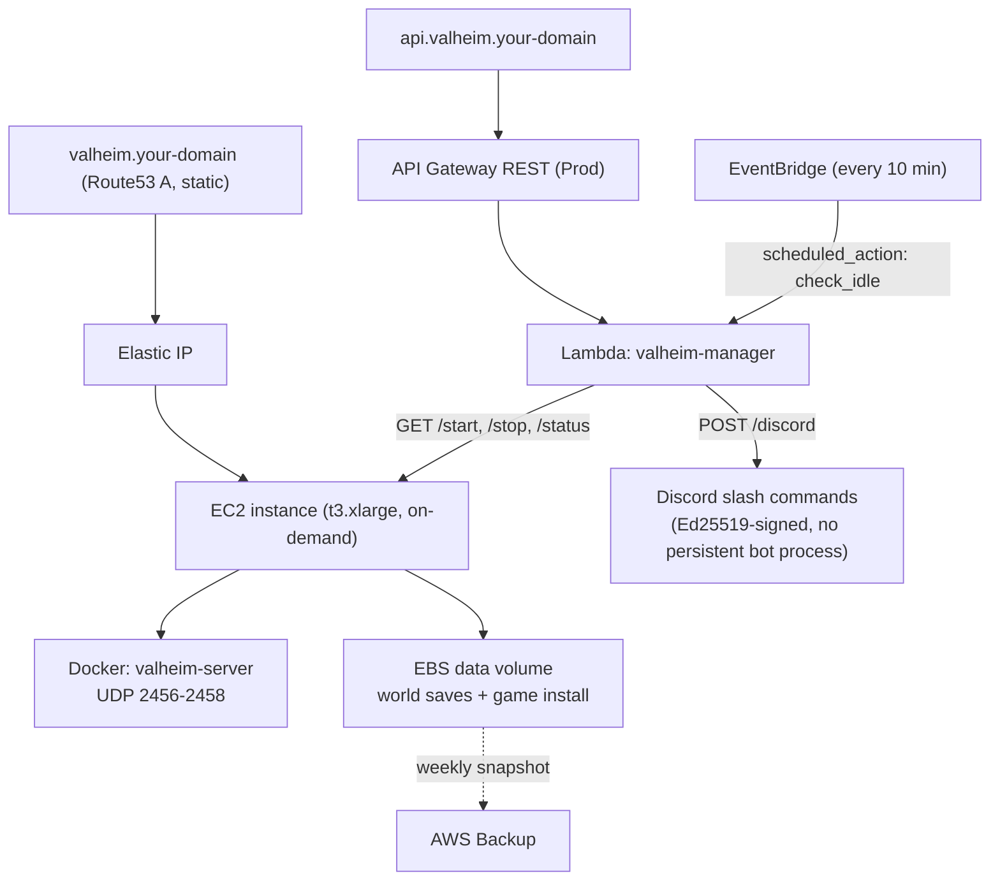

# Valheim on AWS


Valheim dedicated server on a single EC2 instance, managed by Terraform, with an
API-driven start/stop + idle-auto-stop layer so the server (and its bill) isn't
running 24/7 - plus an optional Discord slash-command integration
(`/valheim-start`, `/valheim-stop`, `/valheim-status`).

This is a template: every account-specific value (domain, AWS account, VPC, ...) is
a variable you supply, not a default baked into the repo. See [Prerequisites](#prerequisites)
and [Configure](#configure) below.

> **Setting up a brand-new personal AWS account?**
> [samdammers/aws-personal-account-template](https://github.com/samdammers/aws-personal-account-template)
> bootstraps secure sign-in (Google login via Auth0 + IAM Identity Center, no IAM
> user password) plus baseline guardrails (CloudTrail, an org-wide SCP, cost
> anomaly alerts) - a good first step before deploying stacks like this one. It's
> optional and independent, but its outputs cover most of this template's own
> prerequisites: its default VPC adoption satisfies [prerequisite 3](#3-a-vpc-with-a-public-subnet),
> its `artifacts-<account-id>` bucket is exactly the state bucket
> [prerequisite 4](#4-terraform-and-an-s3-bucket-for-its-state) asks for, and setting its
> `domain_name` variable creates the hosted zone
> [prerequisite 2](#2-a-domain-delegated-to-a-route53-hosted-zone) needs.

## AI disclosure

This repo was built collaboratively with Claude (Anthropic's AI). Reviewing
the Terraform and the caveats below yourself is recommended before applying
any of this to your own account.

## Architecture



The Discord slash commands (`/valheim-start`, `/valheim-stop`, `/valheim-status`) go
through the same Lambda, via the `/discord` route - `/valheim-start` and
`/valheim-status` also reply (ephemerally) with the connect address and password.
The EventBridge check stops the instance automatically once average network
activity has been low for `idle_window_minutes` (and it's past
`idle_grace_period_minutes` since the last start).

EC2 (not ECS/Fargate) is deliberate: plain stop/start already preserves the attached
EBS volume, which is exactly what "start on demand, stop when idle" needs, without
extra backup/restore machinery. A static Elastic IP means DNS never needs to change
across stop/start, unlike an ECS/Fargate task, which gets a new IP on every start.

## Prerequisites

You need, already existing in your own AWS account before running `terraform apply`:

### 1. An AWS account, with an authenticated CLI

If you don't have one: [sign up here](https://portal.aws.amazon.com/billing/signup)
(needs a credit card, but this stack's monthly cost is small - see
[Cost](#cost) below). Then, rather than using the root login day-to-day, create an
IAM user or role for yourself and install/configure the AWS CLI:

- [Creating an IAM user](https://docs.aws.amazon.com/IAM/latest/UserGuide/id_users_create.html)
- [Installing the AWS CLI](https://docs.aws.amazon.com/cli/latest/userguide/getting-started-install.html)
- [Configuring the CLI with your credentials](https://docs.aws.amazon.com/cli/latest/userguide/cli-configure-quickstart.html)
  (`aws configure`) - this stack uses the CLI's default credential chain, no
  hardcoded profile, so whatever `aws sts get-caller-identity` resolves to is what
  Terraform will use.

**Permissions:** this stack creates IAM roles/policies for itself (EC2 instance
role, Lambda role, backup role, API Gateway logging role), on top of EC2, Lambda,
API Gateway, Route53, ACM, Secrets Manager, CloudWatch, and S3 (state) resources.
For a personal project like this, the simplest path is an IAM user/role with the
AWS-managed `AdministratorAccess` policy - a scoped-down policy is possible but
isn't provided here, since Terraform creating IAM roles on your behalf inherently
needs broad IAM permissions itself.

### 2. A domain, delegated to a Route53 hosted zone

This stack only **adds records to** an existing Route53 public hosted zone - it
doesn't register a domain or create the zone for you. If you've applied
[samdammers/aws-personal-account-template](https://github.com/samdammers/aws-personal-account-template)
with its `domain_name` variable set, its `hosted_zone_id` output is exactly
this. Otherwise, two ways to get one:

- **Register a new domain directly through Route53** (simplest - the hosted zone
  is created for you automatically):
  [Registering a new domain](https://docs.aws.amazon.com/Route53/latest/DeveloperGuide/domain-register.html)
- **Already own a domain elsewhere** (Namecheap, GoDaddy, etc.): create a hosted
  zone for it in Route53, then update your registrar's nameserver (NS) records to
  point at the four nameservers Route53 gives you:
  [Working with hosted zones](https://docs.aws.amazon.com/Route53/latest/DeveloperGuide/AboutHZWorkingWith.html)

Either way, once it's set up you'll have a `hosted_zone_id` (looks like
`Z0123456789ABCDEFGHIJ`) - find it any time with:
```bash
aws route53 list-hosted-zones-by-name --dns-name <your-domain>
```

### 3. A VPC with a public subnet

The **default VPC** that every AWS region already has works fine - you don't need
to create a custom one. ([What's a default VPC?](https://docs.aws.amazon.com/vpc/latest/userguide/default-vpc.html))
If you've applied
[samdammers/aws-personal-account-template](https://github.com/samdammers/aws-personal-account-template),
it already adopted this VPC and locked down its default security group - you
still need the VPC/subnet IDs below either way.
Find your default VPC and one of its subnets with:
```bash
aws ec2 describe-vpcs --filters Name=is-default,Values=true --query 'Vpcs[0].VpcId' --output text --region <your-aws-region>
aws ec2 describe-subnets --filters Name=vpc-id,Values=<vpc-id-from-above> --query 'Subnets[0].SubnetId' --output text --region <your-aws-region>
```
Any subnet in the default VPC is public (has a route to an internet gateway), so
the first one returned is fine.

### 4. Terraform, and an S3 bucket for its state

Install Terraform >= 1.16: [developer.hashicorp.com/terraform/install](https://developer.hashicorp.com/terraform/install)

If you've applied
[samdammers/aws-personal-account-template](https://github.com/samdammers/aws-personal-account-template),
its `artifacts-<account-id>` bucket already exists for exactly this - use
that instead of creating a new one. Otherwise, create an S3 bucket you don't
already use for anything else
([Creating a bucket](https://docs.aws.amazon.com/AmazonS3/latest/userguide/creating-bucket.html)),
e.g.:
```bash
aws s3api create-bucket --bucket <your-unique-bucket-name> --region <your-aws-region>
```
(Or skip this and use local state for a quick trial - see [Configure](#configure).)

## Cost

The EC2 instance only bills while it's running (that's the point of
idle auto-stop), at whatever the current on-demand rate is for your chosen
`instance_type` and region - check
[EC2 on-demand pricing](https://aws.amazon.com/ec2/pricing/on-demand/) for a
figure, since it varies by region and changes over time. On top of that, small
fixed costs run whether or not the server is up: the 15GB `gp3` EBS volume, the
Elastic IP's hourly fee (billed even while stopped), the Route53 hosted zone
(~$0.50/month if you created it just for this), weekly EBS backup storage, and
S3 for Terraform state - all together typically a few dollars a month. Lambda
and API Gateway are effectively free at this call volume (well under the
AWS free tier).

## Configure

```bash
cp .envrc.example .envrc   # fill in domain, hosted_zone_id, vpc_id, subnet_id, etc., then: direnv allow
cd terraform/
cp backend.hcl.example backend.hcl   # fill in your state bucket (or delete backend.tf for local state)

terraform init -backend-config=backend.hcl
terraform apply
```

`.envrc` and `backend.hcl` are both gitignored - see `.envrc.example` and
`backend.hcl.example` for the full list of variables and their descriptions
(`terraform/variables.tf` is the source of truth). This repo uses `TF_VAR_*`
environment variables (via [direnv](https://direnv.net/)) rather than a
tracked `terraform.tfvars`, so nothing here depends on you remembering to
`-var-file` anything.

Then populate the server password (never stored in Terraform state):

```bash
aws secretsmanager put-secret-value \
  --secret-id valheim/credentials \
  --secret-string '{"SERVER_PASS":"your-password-here"}' \
  --region <your-aws-region>
```

The password only takes effect on the container's *next first boot* - either
`terraform apply -replace=aws_instance.valheim` for a clean fresh boot (old world
data is untouched, since it lives on the separate EBS data volume, not the instance),
or SSM into the box and re-run the `docker run` command by hand for a one-off change
without a full replace.

## Day-to-day operations

### Start / stop

```bash
curl https://api.valheim.<your-domain>/start
curl https://api.valheim.<your-domain>/stop
curl https://api.valheim.<your-domain>/status

# Or directly via CLI
aws ec2 start-instances --instance-ids <instance-id> --region <your-aws-region>
aws ec2 stop-instances --instance-ids <instance-id> --region <your-aws-region>
```

The server auto-stops itself after `idle_window_minutes` of low network activity
(checked every 10 minutes, with `idle_grace_period_minutes` after each start so a
fresh boot isn't stopped before anyone connects). Tune these three variables in
`terraform/variables.tf` (or your `.envrc`) once you've watched real
CloudWatch `NetworkIn` numbers for a few sessions - the defaults are a starting
heuristic, not a measured value.

### Connecting

Add server: `valheim.<your-domain>` (or the Elastic IP from `terraform output elastic_ip`),
port 2456. Give it ~1-2 minutes after `/start` for Docker to boot and the game server
to come up.

### Logs / admin shell

No SSH - connect via SSM Session Manager:

```bash
aws ssm start-session --target <instance-id> --region <your-aws-region>
sudo docker logs -f valheim
```

### Admins / whitelist

Add SteamID64s to `admin_steamids` in your `.envrc` (JSON-array syntax - see `.envrc.example`) and `terraform apply`
- this rewrites user-data, which only takes effect on a fresh instance (see caveats
below). For a same-session change without a full replace, SSM in and re-run the
container with updated `ADMINLIST_IDS`.

### Discord bot (optional)

Slash commands `/valheim-start`, `/valheim-stop`, `/valheim-status` - same Lambda,
via the `/discord` webhook route, no separate hosting (no always-on bot process to
run anywhere). Skip this whole section if you don't want it: leave
`TF_VAR_discord_public_key` blank in your `.envrc` and the `/discord` route just rejects
every request with 401.

Three Discord values are involved, and only one of them is actually a Terraform
variable: a **public key** (goes in Terraform, verifies that requests really came
from Discord - not secret), a **bot token** (goes in Secrets Manager, used once to
register the commands - a real secret, never commit it or put it in `.envrc`), and
an **Application ID** (just a value you keep handy for step 5 below - Terraform
never needs it, since neither the Lambda nor any resource here reads it).

1. Go to the [Discord Developer Portal](https://discord.com/developers/applications)
   -> **New Application**, give it a name. This is the one-time app setup Discord's
   own docs walk through in more detail if you want it:
   [Discord: Overview of Apps](https://discord.com/developers/docs/quick-start/overview-of-apps).
2. On the app's **General Information** page, note the **Application ID** (you'll
   need it for step 5) and copy the **Public Key** into `TF_VAR_discord_public_key`
   in your `.envrc`, then `terraform apply`.
3. Still on **General Information**, set **Interactions Endpoint URL** to the value
   of `terraform output discord_interactions_url`. Discord immediately sends a test
   request here and will refuse to save the URL unless the Lambda is already
   deployed with the matching public key - so this step has to come *after* step 2's
   `apply`, not before.
4. On the **Bot** tab, click **Reset Token** to reveal the bot token, then push it
   straight to Secrets Manager (never through Terraform or git):
   ```bash
   aws secretsmanager put-secret-value \
     --secret-id valheim/discord-bot-token \
     --secret-string "<paste-the-bot-token>" \
     --region <your-aws-region>
   ```
5. Register the slash commands with Discord (one-off; re-run only if the command
   list itself changes - this bulk-overwrites Discord's global command list for
   your app, it doesn't merge):
   ```bash
   DISCORD_APPLICATION_ID=<the-application-id-from-step-2> AWS_REGION=<your-aws-region> ./scripts/register-discord-commands.sh
   ```
6. On the **OAuth2 -> URL Generator** tab, check **both** the `bot` and
   `applications.commands` scopes, open the generated URL, and invite the app to
   your server. Without `applications.commands` checked, the commands won't show up
   in that server even though they're registered globally in step 5.

### World modifiers: presets or individual dials

Three variables combine to build the world modifier flags Valheim actually
gets, in this order (each layer only fills in what the one before it didn't
set):

1. **`world_preset`** - a named preset from `terraform/world-presets.yaml`
   (`"vanilla"` (default, no modifiers), `"casual"`, `"hardcore"`, or add your
   own to that file - it's just data, no Terraform changes needed).
2. **`world_modifiers`** - override individual dials on top of the preset (or
   with no preset at all): `combat`, `deathpenalty`, `resources`, `raids`,
   `portals`. Each has a fixed, validated set of valid values (see
   `variables.tf`'s description for `world_modifiers` for the full list) -
   `terraform plan` will reject a typo immediately rather than let it reach
   the server.
3. **`world_setkeys`** - a free-form list of global toggles (e.g.
   `["playerevents", "dungeonbuild", "passivemobs"]`). Deliberately not
   validated: Valheim doesn't publish one single exhaustive list of these,
   and an unrecognized one is just silently ignored server-side rather than
   erroring.

`server_args` still exists too, as a raw escape hatch appended after all of
the above, for anything they don't cover.

Example: `world_preset = "casual"` with `world_modifiers = { raids = "less" }`
gets you the casual preset's combat/deathpenalty/resources/portals values,
with raids specifically overridden to `less` instead of casual's own value.

### Creating a new world (world modifiers, difficulty, seed)

World modifiers only take effect when a world is **first generated** - changing
`world_name`, `world_preset`/`world_modifiers`/`world_setkeys`, or `server_args`
in Terraform does nothing to a world that already exists on disk. Two ways to
create a new one:

- **Clean (recommended)**: `terraform apply -replace=aws_instance.valheim` - destroys
  and recreates just the EC2 instance. The EBS data volume is a separate resource and
  isn't touched; the Elastic IP re-associates automatically (no DNS change). The
  fresh instance's first-boot `user_data` runs for real this time, generating a new
  world under whatever `world_name` is currently set.
- **Manual**: SSM in, `docker rm -f valheim`, then re-run the `docker run` command
  from `templates/user_data.sh.tftpl` by hand with the new `WORLD_NAME`/`SERVER_ARGS`
  env vars (`terraform console` then `local.generated_server_args` prints the
  resolved flags if you're using `world_preset`/`world_modifiers`/`world_setkeys`
  rather than typing them out yourself).

The old world's files aren't touched by either path above - they just sit alongside
the new one on the data volume unless explicitly removed. If you don't want to keep
the old world, delete it first (SSM in, before or after the switch-over):
```bash
sudo rm -f /mnt/valheim-data/config/worlds_local/<OldWorldName>.db /mnt/valheim-data/config/worlds_local/<OldWorldName>.fwl
```
(Any hourly local backups of it under `/mnt/valheim-data/config/backups/` are separate
- remove those too if you want a clean slate; they're not touched by AWS Backup's
weekly EBS *volume* snapshots either way.)

World seed has no CLI flag at all - the only way to pin one is generating it locally
in a normal Valheim client first, then uploading the resulting `.db`/`.fwl` files to
the volume before first boot. World size has no exposed setting at all - it's a fixed
radius in vanilla Valheim; changing it needs the third-party "Expand World Size" mod
(BepInEx), which this template doesn't run.

## Terraform

All infrastructure is in `terraform/`. Uses the AWS CLI default credential chain (no
hardcoded profile) - make sure your CLI is authenticated before running.

| File | Purpose |
|---|---|
| `variables.tf` | Every input this stack takes - see `.envrc.example` |
| `world-presets.yaml` | Named world modifier presets for `world_preset` - just data, edit freely |
| `ec2.tf` | EC2 instance, EBS data volume + attachment, Elastic IP |
| `security_groups.tf` | UDP 2456-2458 ingress only - no SSH |
| `templates/user_data.sh.tftpl` | First-boot script: installs Docker, mounts the data volume, runs the container |
| `lambda.tf` | Lambda function + EventBridge idle-check rule + PyNaCl vendoring (`null_resource`) |
| `lambda/manager.py` | Lambda handler - start/stop/status, idle auto-stop, Discord interactions |
| `lambda/requirements.txt` | PyNaCl - vendored into the zip for Discord's Ed25519 signature verification |
| `apigateway.tf` | REST API - `/start` `/stop` `/status` `/discord`, custom domain |
| `acm.tf` | Regional ACM cert for the API custom domain (DNS-validated) |
| `dns.tf` | Route53 - static A record to the EIP + API custom domain alias |
| `iam.tf` | EC2 instance role (SSM + Secrets Manager), Lambda role, API Gateway account-level CloudWatch role |
| `secrets.tf` | Secrets Manager secret (password set out-of-band) |
| `backup.tf` | AWS Backup - weekly EBS snapshot, 8-week retention |
| `backend.tf` | S3 state backend (partial config - see `backend.hcl.example`), native `use_lockfile` locking (no DynamoDB) |

### Important caveats

- **`user_data` only runs on first boot** (standard cloud-init behaviour) - it is *not*
  re-run on every `/start`. This is fine for our stop/start pattern: the data volume
  auto-mounts via `/etc/fstab` on every boot, and Docker restarts the container
  (`--restart unless-stopped`) whenever the daemon starts. But it means changing
  `server_name`, `world_name`, `server_args`, `admin_steamids`, etc. won't take effect
  until the instance is replaced (`terraform apply -replace=aws_instance.valheim` -
  safe, the EBS data volume isn't touched) or you make the change by hand over SSM.
- **The API Gateway account-level CloudWatch logging role** (`aws_api_gateway_account`)
  is a singleton per AWS account/region. This stack manages it by default
  (`manage_api_gateway_account = true`) so `terraform apply` works standalone in a
  fresh account - if you're layering this alongside another Terraform stack that
  already manages that same setting in the same account, set
  `manage_api_gateway_account = false` here instead, or the two stacks will fight
  over it (and risk clobbering it on `destroy`).
- **Idle-stop is heuristic** - it uses average `NetworkIn` over a trailing window,
  not actual player count. Watch real metrics for a session or two and tune
  `idle_window_minutes`, `idle_grace_period_minutes`, `idle_threshold_bytes` in your
  `.envrc`.
- **Elastic IP costs a small hourly fee** even while the instance is stopped (AWS
  bills all EIPs regardless of attachment state) - a few cents a month, not worth
  optimising away for the DNS stability it buys.

## Backups

The data EBS volume is snapshotted weekly (Tuesday 3am AEST - adjust the cron in
`backup.tf` for your own timezone/schedule preference) via AWS Backup
(`valheim-backup` vault, 8-week retention), on top of the Docker image's own hourly
local backups inside `/config` (`BACKUPS_MAX_AGE=3` days).

To trigger a one-off snapshot before a risky change:

```bash
ROLE=$(aws iam get-role --role-name valheim-backup-role --query Role.Arn --output text --region <your-aws-region>)
aws backup start-backup-job \
  --backup-vault-name valheim-backup \
  --resource-arn "$(terraform output -raw data_volume_arn)" \
  --iam-role-arn "$ROLE" \
  --region <your-aws-region>
```

## Contributing

CI (`.github/workflows/terraform.yml`) runs `terraform fmt`, `validate`, and
`tflint` against every push and PR, plus a Python syntax check on the Lambda
handler - all static checks, no AWS credentials involved. Dependabot keeps
provider versions, the Lambda's PyNaCl dependency, and the workflow's own
GitHub Actions up to date. See [CODE_OF_CONDUCT.md](CODE_OF_CONDUCT.md) for
community expectations.
